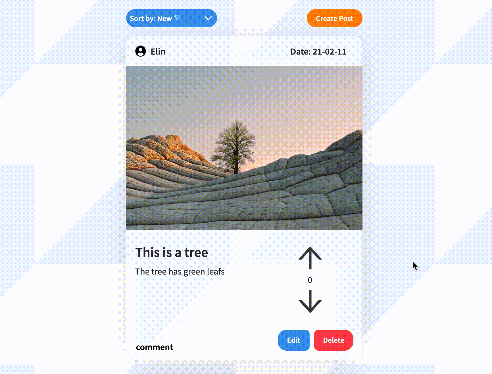

# Speed Feed Social Network
## Overview
Speed Feed is a social network designed and created by myself with native PHP, JS and CSS.The project is hosted on Heroku with a Postgres database.  

## Design 
The idea with the design was to have a modern and soft UI that would implement elements of 'Frosted glass'. For this I utilized the 'backdrop-filter' css proporty.   I believe in the design philosophy that nothing should come out of nowhere and nothing accelerates from 0-1 instantly.   

I tried to follow those rules when i created a costom confirmation box class. 
   
The box is rendered from JS when the 'createPopup' method is called upon. This method returns a promise which will resolve when the user presses the the confirmation button.  

## Technology
The technologies used in this project is only vanilla JS, CSS and HTML. The reason for this is for personal learning purposes. To get an understanding of what it takes to build a social network from scratch and an understanding of the tools used in complex libraries. 

## Features
The app supports the following features 
* Create account 
* Updata account information 
* Login/logout
* Create/edit/delete post 
* Upvote/downvote posts
* Comment on post

## Thoughts/Learnings
While the app is now (should be) fully working, it is missing some functionality. For example, it does not have a router for costum URL and 404-page. 
It also is not as secure as it could be since i have created all logic myself. The site is for example not protected against CSRF-attacks and is missing other security measures found in bigger frameworks. 

If i were to do this project again, I would probaly want to use a reactive framework like React for the frontend, and something like express or laravel for backend. 
I would also chose to use a library for animations to get consistant and well-made animations throughout the app. 
